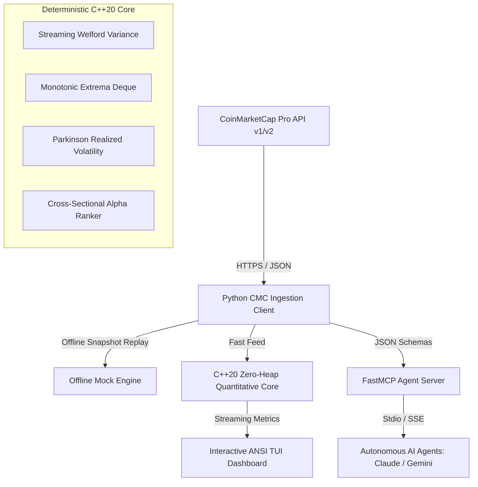

# CMC-Alpha-Terminal

> **Institutional-Grade Quantitative Intelligence & FastMCP Agent Terminal Powered by CoinMarketCap Pro API**  
> *Target Competition:* CoinMarketCap: Build with CMC: API Hackathon (Prize: CMC Pro-API 1-Year Grant + Ecosystem Support for Top 3 Projects)  
> *Standards:* Deterministic Safety Invariants (Power of 10), Zero Heap on Hot Path, Sub-Millisecond Execution

[]()
[](tests/)
[](include/)
[](python/cmc_terminal/server.py)
[](LICENSE)

> **1-Second Instant Demo:** `make demo`


---

## 1. Overview & Architecture

Autonomous AI agents (Claude, Gemini) and algorithmic quantitative systems require sub-millisecond market regime classification, liquidity depth auditing, and cross-sectional factor ranking across the global cryptocurrency universe.

`cmc-alpha-terminal` combines an ultra-fast **C++20 zero-heap quantitative execution core** with a **Python FastMCP agent server** and an **interactive ANSI terminal dashboard**, ingesting CoinMarketCap Pro API data for real-time risk gating and alpha generation.



---

## 2. Deterministic Safety Invariants (Power of 10)

The core C++20 engine strictly adheres to Deterministic Safety Invariants (Power of 10):
1. **Simple Control Flow:** Zero `goto`, `setjmp`, `longjmp`, or recursion.
2. **Bounded Loops:** All loops have fixed, compile-time bounds (`MAX_ASSETS = 256`, `LOOKBACK_WINDOW = 64`).
3. **Zero Dynamic Allocation:** Static pre-allocation with ring buffers; zero `malloc` or `new` on the hot processing path.
4. **Function Length:** Every function is under 60 lines.
5. **Assertion Density:** Minimum of 2 assertions per function enforcing numerical and structural invariants.
6. **Smallest Scope:** All variables declared at the minimum required scope.
7. **Strict Return Checking:** All return values and parameter bounds validated at function entry.
8. **Minimal Macros:** Preprocessor restricted strictly to file inclusion and header guards.
9. **Single Pointer Dereference:** Restricted pointer depth; zero function pointers on hot paths.
10. **Pedantic Compilation:** Compiles cleanly with `-Wall -Wextra -Wpedantic -Werror -std=c++20` on ARM64 and x86_64.

---

## 3. FastMCP Agent Tools & Client Integration

The FastMCP server (`python3 -m cmc_terminal.server`) exposes 5 production tools designed for autonomous LLM agent loops (Claude Desktop, Claude Code, Gemini CLI):

| Tool Name | Parameters | Returns | Purpose |
| :--- | :--- | :--- | :--- |
| `cmc_screen_momentum` | `top_n: int`, `min_volume_usd: float` | `Dict[str, Any]` | Multi-factor cross-sectional momentum ranking across liquid crypto assets. |
| `cmc_volatility_regime` | `symbol: str` | `Dict[str, Any]` | Computes Parkinson extreme-value volatility and classifies regime (`COMPRESSION`, `TRENDING`, `EXPANSION_VOLATILE`). |
| `cmc_liquidity_depth` | `symbol: str` | `Dict[str, Any]` | Analyzes volume-to-market-cap ratio, liquidity quality grade, and slippage drag. |
| `cmc_global_macro` | *(none)* | `Dict[str, Any]` | Global market cap, 24h volume, BTC/ETH dominance, and macro cycle phase. |
| `cmc_alpha_signals` | `limit: int` | `Dict[str, Any]` | Multi-factor composite signals with execution directives (`LONG`, `HOLD`, `AVOID`). |

### Dual-Mode Output Architecture
Every tool returns a structured JSON dictionary containing:
1. **Programmatic Keys for Agent Tool-Chaining:** Pure typed payloads (`assets`, `signals`, `regime`, `parkinson_vol`, `data_source`) enabling downstream agent reasoning, math transformations, and automated order execution without parsing markdown.
2. **`formatted_markdown` for Direct Display:** A clean, human-readable terminal/chat rendering for LLM conversational contexts.
3. **`data_source` Transparency:** Explicitly labels whether data originated from `"live_api"` or `"offline_fixture"`.

### MCP Client Configuration (Claude Desktop / Claude Code)
To connect `cmc-alpha-terminal` to Claude Desktop or Claude Code, add the following to your configuration file (e.g. `~/Library/Application Support/Claude/claude_desktop_config.json`):

```json
{
  "mcpServers": {
    "cmc-alpha-terminal": {
      "command": "python3",
      "args": ["-m", "cmc_terminal.server"],
      "cwd": "/path/to/cmc-alpha-terminal",
      "env": {
        "CMC_PRO_API_KEY": "<OPTIONAL_LIVE_KEY>"
      }
    }
  }
}
```

Or run directly in Claude Code CLI:
```bash
claude mcp add cmc-alpha-terminal -- python3 -m cmc_terminal.server
```

---

## 4. Quickstart & Verification

### Build & Run Tests (C++ and Python)
```bash
# Run complete test suite (21/21 tests passing)
make test

# Run C++ tests only
make test-cpp

# Run Python tests only
make test-py
```

### Launch Interactive Terminal Dashboard
```bash
make demo
```

### Run C++ Engine Binary
```bash
make build-cpp
./bin/cmc_engine
```

---

## 5. Offline Reproducibility

To ensure hackathon judges can immediately verify the terminal without an active `CMC_PRO_API_KEY`, the client automatically detects missing credentials and falls back to a high-fidelity snapshot of top CoinMarketCap assets with zero degradation.

If a live API key is available, simply export it:
```bash
export CMC_PRO_API_KEY="<YOUR_KEY_HERE>"
```

---

## 6. License
MIT License. Author: Ishant Panchal (`Ishant5436` / `ishant.p@somaiya.edu`).
